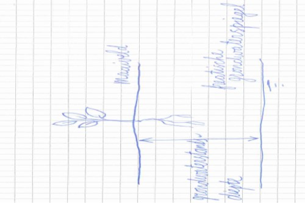
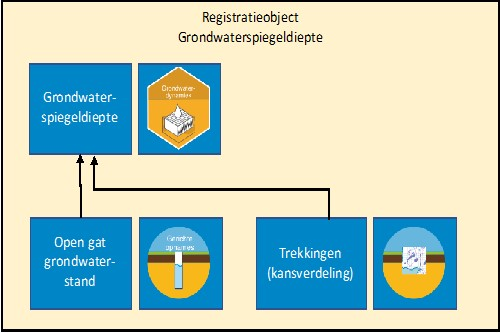
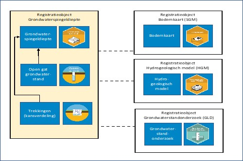

Beschrijving
------------

Het model grondwaterspiegeldiepte is een registratieobject in het domein
modellen. Het gaat in dit domein om schattingen of voorspellingen van de opbouw
en eigenschappen van de bodem of ondergrond in twee of drie dimensies. Modellen
zijn sterk afhankelijk van de hoeveelheid en kwaliteit van de beschikbare
gegevens zoals metingen van de diepte tot de grondwaterspiegel. De kwaliteit van
de modellen zal daarom toenemen naarmate er meer metingen in de BRO beschikbaar
komen. Het model grondwaterspiegeldiepte is een tweedimensionaal model van de
diepte tot de grondwaterspiegel, met een resolutie van 50 bij 50 meter, en geeft
informatie over de dieptes waartussen de grondwaterspiegel jaarlijks gemiddeld
fluctueert.

Het grondwater bevindt zich in Nederland meestal tot op geringe diepte, en is
daarom van invloed op gewasgroei, ecosystemen, uitspoeling van nutriënten,
funderingen, maaivelddaling, berijdbaarheid en dergelijke. Informatie over de
grondwaterspiegeldiepte, het grensvlak tussen de verzadigde en onverzadigde
zone, wordt onder meer gebruikt bij het berekenen van schade-uitkeringen aan
agrariërs in waterwingebieden, bij het schatten van de nitraatuitspoeling naar
het grondwater voor onderbouwing van het mestbeleid en bij de voorbereiding van
civieltechnische werken. Veel toepassingen vragen om uniforme en actuele
gegevens over grondwaterkarakteristieken die de diepte waarop de
grondwaterspiegel jaarlijks fluctueert beschrijven.

Aanvankelijk is bij de totstandkoming van de bodemkaart van Nederland 1:50.000
de grondwaterspiegeldiepte simultaan met de bodem gekarteerd, en als
grondwatertrappen (Gt’s) op de kaart weergegeven. Gt’s geven per kaartvlak met
klassen aan tussen welke grenzen de grondwaterspiegeldiepte jaarlijks gemiddeld
genomen fluctueert. Deze Gt-informatie op de landsdekkende kaart is nu echter
niet meer uniform, want gedurende een periode van circa 40 jaar is sprake
geweest van regionale aanpassingen en van verbeteringen en verfijningen van de
Gt-kaart. Gaandeweg zijn ook de klassenindeling en de legenda aangepast.
Bovendien is door ingrepen in de waterhuishouding die sinds de karteringen
hebben plaatsgevonden de Gt-informatie voor verschillende gebieden niet meer
actueel. Vanaf 2002 is daarom een nieuwe methodiek toegepast om karakteristieken
voor de seizoensfluctuatie van de grondwaterspiegel in kaart te brengen. Gt’s
zijn hiervan af te leiden.

Met de nieuwe methodiek is eerst de grondwaterspiegeldiepte van hoog Nederland
in kaart gebracht, namelijk tussen 1997 en 2004, onder meer ter ondersteuning
van het mestbeleid. Vervolgens is de Gt-kaart voor laag Nederland geactualiseerd
(Hoogland e.a., 2014), waarbij de actuele inhoud van de kaarteenheden van de
Gt-kaart, schaal 1 : 50.000, middels een kanssteekproef is beschreven. In 2018
is een start gemaakt met de kartering van de grondwaterspiegeldiepte in laag
Nederland (Stuyt e.a., 2018). Hierbij werd de benadering die in hoog Nederland
is gevolgd aangepast aan de hydrologische situatie in laag Nederland. Denk
daarbij aan de invloed van peilbeheer op de grondwaterspiegeldiepte, de variatie
in grondwaterspiegeldiepte binnen percelen en weinig of geen samenhang tussen
grondwaterspiegeldiepte en maaiveldshoogte. Met hoog en laag Nederland ontstaat
daarmee een landsdekkend beeld van de grondwaterspiegeldiepte. Hierbij dient
opgemerkt te worden dat gebieden waar grondwater zo diep zit dat geen aanvulling
van grondwater naar het bodemprofiel plaatsvindt niet op de kaart zijn ingevuld
(de ‘witte’ gebieden).

Definitie van het model grondwaterspiegeldiepte
-----------------------------------------------

>   Model Grondwaterspiegeldiepte Voor dit registratie-object is het niveau van
>   de (freatische) grondwaterspiegel bedoeld ten opzichte van maaiveld en niet
>   ten opzichte van een vast referentieniveau (meestal NAP). De term
>   ‘Grondwaterspiegeldiepte’ geeft aan dat het referentieniveau maaiveld is.
>   Voor de term *grondwaterspiegeldiepte* is gekozen omdat deze taalkundig
>   beter is dan de term grondwaterstandsdiepte en beter aansluit bij de term
>   *water table depth* die in de internationale literatuur wordt gebruikt. Het
>   registratieobject ‘Model Grondwaterspiegeldiepte’[^1] is landsdekkend en
>   heeft op dit moment betrekking op het niet-verharde, niet-bebouwde deel van
>   Nederland. Het model grondwaterspiegeldiepte is gebaseerd op gemeten
>   grondwaterspiegeldieptes en gebiedsdekkende hulpinformatie zoals
>   hoogtemodellen van het maaiveld. Opgenomen zijn verschillende, statistisch
>   berekende karakteristieken van de dynamiek (seizoensfluctuatie) van de
>   grondwaterspiegeldiepte in Nederland.

[^1]: De Engelse benaming van het registratieobject is: Water Table Depth Model
(afkorting gebruikt binnen het BRO programma is: WDM)

We spreken over een model van de grondwaterspiegeldiepte omdat het
gebiedsdekkende voorspellingen (interpolaties) betreft, die met statistische
methoden zijn berekend uit waargenomen grondwaterspiegeldieptes en daarmee
samenhangende informatie uit verschillende gegevensbronnen. Het is dus geen
model dat fysische processen beschrijft.

De belangrijkste dynamische karakteristieken zijn de gemiddeld hoogste en
gemiddeld laagste grondwaterstand (GHG en GLG) die weer worden gebruikt voor een
classificatie in Grondwatertrappen (Gt’s) zoals we die in Nederland kennen.

De nauwkeurigheid van de grondwaterspiegeldieptekarakteristieken is eveneens
onderdeel van het model, in de vorm van een groot aantal (300 of meer)
realisaties (trekkingen) uit de kansverdelingen van deze karakteristieken. Door
realisaties (trekkingen) uit de kansverdeling op te nemen in het model hoeft de
BRO gebruiker van het model grondwaterspiegeldiepte geen veronderstellingen te
doen over de vorm van de kansverdeling.

Het model grondwaterspiegeldiepte verschilt van voorspellingen die met
fysisch-mechanistische modellen kunnen worden gemaakt van de
grondwaterspiegeldiepte (of karakteristieken daarvan), zoals het Landelijk
Hydrologisch Model (LHM). Het verschil uit zich in de volgende punten:

1.  Resolutie (50x50 m bij het model grondwaterspiegeldiepte, 250x250 m bij het
    LHM;

2.  Het model grondwaterspiegeldiepte is een ruimtelijk model dat is gebaseerd
    op circa één waarneming per km2. Modelveronderstellingen hebben betrekking
    op de ruimtelijke correlatiestructuur (ruimtelijke patroon) van deze
    waarnemingen. Het LHM is een fysisch-mechanistisch model dat is gebaseerd op
    een beschrijving van processen van grondwaterstroming.
    Modelveronderstellingen hebben betrekking op deze processen.

3.  Het model grondwaterspiegeldiepte is statistisch gebaseerd en geeft daardoor
    een kwantitatieve indicatie van de nauwkeurigheid van de ruimtelijk
    voorspelde GHG’s en GLG’s. Het LHM is fysisch gebaseerd en een kwantitatieve
    indicatie van de nauwkeurigheid van GHG’s en GLG’s die met het LHM zijn
    voorspeld is alleen achteraf door validatie te geven.

Karakteristieken van de grondwaterspiegeldiepte
-----------------------------------------------

De term ‘Grondwaterdynamiek’ is in 2002 geïntroduceerd door Finke e.a. (2002)
[5] als een verzamelterm voor een aantal karakteristieken die de diepte beneden
maaiveld karakteriseren waarbinnen jaarlijks de freatische grondwaterspiegel
fluctueert: GHG, GLG, GVG, Gt, duurlijn, regimecurve en kwelklasse. De
afkortingen worden hieronder verklaard. Ritzema e.a. (2012) geven definities van
de GxG (GxG is een verzamelterm voor GHG, GLG en GVG). Waar in deze definities
sprake is van ‘grondwaterstand’ wordt de grondwaterspiegeldiepte ten opzichte
van maaiveld bedoeld (figuur 1). Deze wordt uitgedrukt in centimeters. Het teken
van de GxG is positief voor standen beneden maaiveld.

*Figuur 1 Grondwaterstand: grondwaterspiegeldiepte ten opzichte van maaiveld*

Gemiddelde Hoogste Grondwaterstand (GHG): Gemiddelde van de HG3 over een periode
van 30 jaar onder gegeven klimatologische en waterhuishoudkundige
omstandigheden.

-   HG3: gemiddelde van de drie hoogste grondwaterstanden in een hydrologisch
    jaar (1 april t/m 31 maart) bij een meetfrequentie van tweemaal per maand
    (rond de 14e en 28e).

Gemiddelde Laagste Grondwaterstand (GLG): Gemiddelde van de LG3 over een periode
van 30 jaar onder gegeven klimatologische en waterhuishoudkundige
omstandigheden.

-   LG3: gemiddelde van de drie laagste grondwaterstanden in een hydrologisch
    jaar (1 april t/m 31 maart) bij een meetfrequentie van tweemaal per maand
    (rond de 14e en 28e).

Gemiddelde Voorjaars Grondwaterstand (GVG): Gemiddelde van de VG3 over een
periode van 30 jaar onder gegeven klimatologische en waterhuishoudkundige
omstandigheden.

-   VG3: gemiddelde van de grondwaterstanden op 14 maart, 28 maart en 14 april
    in een bepaald kalenderjaar.

De Gt, grondwatertrap, is een typische combinatie van GHG- en GLG-klassen die op
thematische kaarten kan worden weergegeven. In de loop van de tijd is deze
classificatie aangepast en uitgebreid, zie Tabel 1 voor een overzicht.

Tabel 1 Grondwatertrappenindelingen voor de Bodemkaart van Nederland, schaal 1 :
50 000, met kwalitatieve toevoegingen

| Gt-klassen | Klassegrenzen in cm. - maaiveld | Kwalitatieve toevoegingen (sinds 1988) |            |                |         |
|------------|---------------------------------|----------------------------------------|------------|----------------|---------|
| 1966       | 1977                            | 1988                                   | GHG        | GLG            |         |
| I          | I                               | I                                      | \- (0-20)1 | \<50           | w       |
| II         | II                              | II                                     | \- (0-30)1 | 50-80          | b, w    |
|            | II\*                            | IIb                                    | 25-40      | 50-80          |         |
|            |                                 | IIc                                    | \>40       | 50-80          |         |
| III        | III                             | III                                    | \<40       | 80-120         | b, w    |
|            | III\*                           | IIIb                                   | 25-40      | 80-120         |         |
| IV         | IV                              | IV                                     | 40-80      | 80-120         | b       |
|            |                                 | IVc                                    | \>80       | 80-120         |         |
| V          | V                               | V                                      | \<40       | \>120          | b, s, w |
|            | V\*                             | Vb                                     | 25-40      | \>120          |         |
| VI         | VI                              | VI                                     | 40-80      | \>120          | b, s    |
| VII        | VII                             | VII                                    | 80-140     | \>120          | b, s    |
|            | VII\*                           | VIII                                   | \>140      | \>120 (\>160)1 |         |

1(...) meest voorkomende waarden binnen een groter GHG- of GLG-traject

Verklaring:

Kwantitatieve toevoegingen Gt (sinds 1988):

...b = GHG tussen 25 en 40 cm – maaiveld

...c = constant; geringe fluctuatie

Kwalitatieve toevoegingen (sinds 1988):

b... = buiten de hoofdwaterkering gelegen gronden; periodiek overstroomd

s... = schijnspiegels; bij gronden met een grondwaterstandsfluctuatie (GLG-GHG)
van meer dan 120 cm

w... = water boven maaiveld; aaneengesloten periode van meer dan één maand
tijdens de winterperiode (alleen bij binnen de hoofdwaterkering gelegen gronden)

Sinds 2002 heeft de praktijk uitgewezen dat vooral informatie over GHG, GLG, en
Gt wordt gebruikt. Ook het gebruik van de GVG lijkt zinvol al wordt daar minder
vaak naar gevraagd. De definitie (en daarmee ook gegevensinhoud) van dit
registratie-object beperkt zich daarom nu tot deze parameters.

>   Grondwaterdynamiek versus Grondwaterspiegeldiepte Bij WENR, waar ooit de
>   term grondwaterdynamiek is ontstaan (Finke e.a.,2002, 2004) is indertijd een
>   methodiek ontwikkeld waarvoor de term dynamiek passend was. De praktijk van
>   de laatste ca. 20 jaar heeft echter uitgewezen dat vooral (of uitsluitend)
>   om GHG, GLG en Gt wordt gevraagd, en bij natuurtoepassingen ook om GVG. Een
>   deel van de destijds ontwikkelde methodiek bleef daardoor onbenut. In de
>   toekomst kan de behoefte aan informatie wijzigen. Een oorzaak hiervoor zou
>   kunnen zijn dat grondwaterstanden op steeds meer locaties met hoge
>   frequentie (bijvoorbeeld dagelijks) worden geregistreerd, terwijl GHG, GLG
>   en Gt nog op halfmaandelijks waargenomen grondwaterspiegeldieptes zijn
>   gebaseerd. Modellen en tabellen voor landevaluatie en natuurbeheer zijn
>   echter gebaseerd op GHG’s, GLG’s en daarvan afgeleide gemiddelde
>   voorjaarsgrondwaterstanden (GVG’s): HELP-tabellen (Werkgroep HELP-tabel,
>   1987), TCGB-tabellen (Bouwmans, 1990), Waterwijzer Landbouw, Hydrologische
>   Randvoorwaarden Natuur (Runhaar en Hennekens, 2014).

Gerichte opnames grondwaterspiegeldiepte
----------------------------------------

Een belangrijk onderdeel van de methodiek voor het model grondwaterspiegeldiepte
vormen de zogeheten gerichte opnames van grondwaterstanden, die ‘gericht’ in het
voorjaar en najaar worden uitgevoerd. Deze vinden plaats in aanvulling op de
grondwaterstanden uit de BRO (grondwaterstandonderzoek) en gegevens uit andere
bronnen, met als doel het meetnet van grondwaterstanden te verdichten. Gerichte
opnames van de grondwaterstandsdiepte worden in het veld uitgevoerd op daartoe
geselecteerde locaties. Op die locaties wordt de grondwaterstandsdiepte twee
keer in een open boorgat gemeten: één keer aan het einde van het zomerseizoen
(GLG) en één keer aan het einde van het winterseizoen (GHG). Deze metingen
worden ‘gerichte opnames’ genoemd, namelijk gericht op het in kaart brengen van
de GLG en de GHG.

Nauwkeurigheid van informatie over de grondwaterspiegeldiepte
-------------------------------------------------------------

>   Werkelijkheid en Model Elk model benadert een deel van de werkelijkheid in
>   een bepaalde mate en elk model heeft dus een bepaalde mate van
>   nauwkeurigheid (is mate van overeenstemming met de werkelijkheid), die
>   direct in onzekerheid over die werkelijkheid is te vertalen. Als bij een
>   model de nauwkeurigheid niet is gekwantificeerd, dan maakt dit zo'n model
>   niet nauwkeuriger dan een model waarbij dit wel is gebeurd, zoals het model
>   grondwaterspiegeldiepte. Feitelijk is de kwaliteit van een model waarbij de
>   nauwkeurigheid niet is gekwantificeerd lager dan wanneer dit wel is gebeurd:
>   bijvoorbeeld omdat zo'n model niet geschikt is voor onzekerheidsanalyses
>   heeft het minder toepassingsmogelijkheden. Omdat je de nauwkeurigheid niet
>   kent is het ook niet duidelijk voor welke toepassingen zo’n model geschikt
>   is en voor welke niet.

De gebiedsdekkende voorspellingen van GHG en GLG voor 50x50m-gridcellen, die
tezamen het model grondwaterspiegeldiepte vormen, hebben een bepaalde
nauwkeurigheid. Deze nauwkeurigheid kan het meest compleet worden beschreven met
een kansverdeling, die voor elke 50x50m-gridcel aangeeft welk niveau van GHG of
GLG daar met welke waarschijnlijkheid wordt over- of onderschreden. Finke e.a.
(2004) vatten deze kansverdeling samen in 300 realisaties of trekkingen uit de
kansverdeling van GHG en GLG-kaarten. Deze 300 realisaties kunnen bijvoorbeeld
worden gebruikt als invoer in niet-lineaire modellen en voor
onzekerheidsanalyses.

Het registratieobject model grondwaterspiegeldiepte geeft naast *best estimates*
van GHG, GLG en Gt informatie over nauwkeurigheid. Evenals bij Finke e.a. (2004)
worden 300 realisaties opgeslagen, waaruit parameters van de kansverdeling
kunnen worden geschat naar keuze van de gebruiker. Als *best estimate* voor de
GHG en de GLG kan de gebruiker bijvoorbeeld kiezen tussen het gemiddelde en de
mediaan. Als indicatie van de nauwkeurigheid kan de gebruiker bijvoorbeeld
kiezen voor de standaardafwijking of voor percentielen en een percentielafstand,
bijvoorbeeld de afstand tussen het 5de en 95ste percentiel, i.e. een
90%-voorspellingsinterval.

Afhankelijkheid met andere registratieobjecten
----------------------------------------------

Binnen het registratieobject model grondwaterspiegeldiepte zijn meerdere
relevante ‘objecten’ die een samenhang kennen die hieronder geschetst is (figuur
2). Deze relevante objecten zijn de grondwaterspiegeldiepte, de gerichte opnames
(‘open gat grondwaterstand’ in onderstaande figuur) die worden gedaan voor de
bepaling van de GLG en GHG en de trekkingen of realisatie om de kansverdeling te
bepalen en vormen onderdeel van dit registratieobject.

*Figuur 2 ‘Objecten’ binnen dit Registratieobject*

Het model grondwaterspiegeldiepte hangt niet direct samen met andere
registratieobjecten uit de BRO, maar wel indirect, omdat bij de modellering van
de grondwaterspiegeldiepte gebruik wordt gemaakt van informatie die elders in de
BRO is opgeslagen, zoals bodemkundige informatie, tijdreeksen van
grondwaterstanden en hydrogeologische informatie. Figuur 3 geeft deze indirecte
samenhang met andere registratieobjecten in de BRO aan. Deze indirecte samenhang
is geen onderdeel van dit registratieobject en is ook niet gegevens-inhoudelijk
direct te koppelen.

*Figuur 3 ‘indirecte samenhang met andere registratieobjecten in de BRO*

1.  Het model grondwaterspiegeldiepte hangt samen met de bodemkaart (SGM), omdat
    de combinatie van beide kaarten wordt toegepast bij landevaluatie (berekenen
    van gewasopbrengsten en bepalen van standplaatscondities). Eerder waren Gt’s
    geometrisch direct gekoppeld aan de bodemkaartvlakken.

2.  Het model grondwaterspiegeldiepte zal ook in de toekomst samenhangen met de
    bodemkaart (SGM) en kan ook mogelijk samenhangen met het Hydrogeologische
    registratieobject (HGM/REGIS), wanneer blijkt dat er samenhang is van GHG en
    GLG met gebiedsdekkende hulpinformatie uit het hydrogeologische landelijke
    ondergrondmodel.

3.  Het model grondwaterspiegeldiepte hangt samen met grondwaterstandsonderzoek
    (GLD). Bij de totstandkoming van het model worden tijdreeksen uit DINO
    gebruikt. Voorzien is dat deze gegevens onder het RO GLD in de BRO
    geregistreerd gaan worden.
